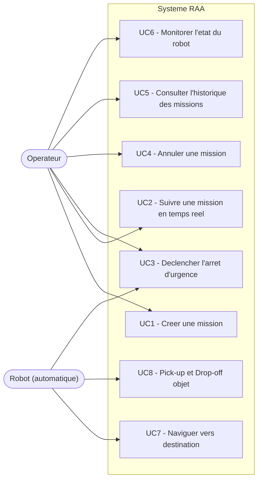
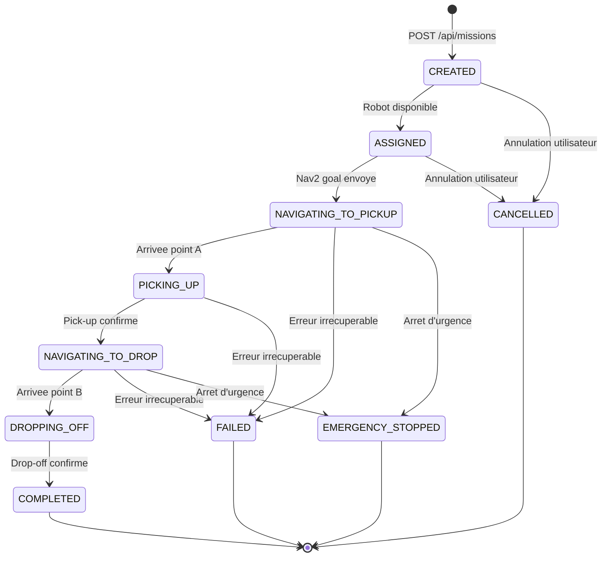
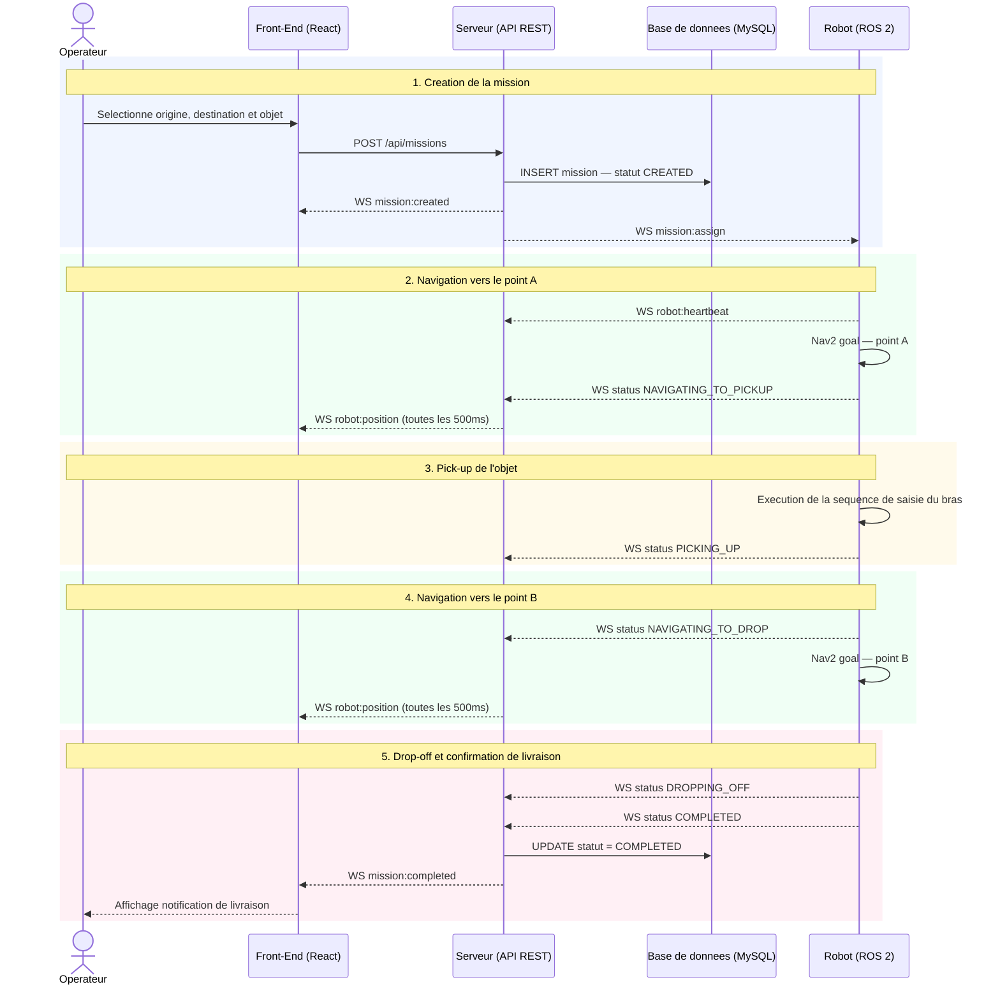

# 5. Diagrammes UML — RAA

---

## 5.1 Diagramme de Use Case

```mermaid
flowchart LR
    Operateur(["Operateur"])
    Robot(["Robot (automatique)"])

    subgraph RAA ["Systeme RAA"]
        direction TB
        UC1["UC1 - Creer une mission"]
        UC2["UC2 - Suivre une mission en temps reel"]
        UC3["UC3 - Declencher l'arret d'urgence"]
        UC4["UC4 - Annuler une mission"]
        UC5["UC5 - Consulter l'historique des missions"]
        UC6["UC6 - Monitorer l'etat du robot"]
        UC7["UC7 - Naviguer vers destination"]
        UC8["UC8 - Pick-up et Drop-off objet"]
    end

    Operateur --> UC1
    Operateur --> UC2
    Operateur --> UC3
    Operateur --> UC4
    Operateur --> UC5
    Operateur --> UC6

    Robot --> UC7
    Robot --> UC8
    Robot --> UC3
```

---

## 5.2 Diagramme d'Etats — Machine a Etats Mission

```mermaid
stateDiagram-v2

    [*] --> CREATED : POST /api/missions

    CREATED      --> ASSIGNED             : Robot disponible
    ASSIGNED     --> NAVIGATING_TO_PICKUP : Nav2 goal envoye
    NAVIGATING_TO_PICKUP --> PICKING_UP   : Arrivee point A
    PICKING_UP   --> NAVIGATING_TO_DROP   : Pick-up confirme
    NAVIGATING_TO_DROP   --> DROPPING_OFF : Arrivee point B
    DROPPING_OFF --> COMPLETED            : Drop-off confirme
    COMPLETED    --> [*]

    CREATED              --> CANCELLED         : Annulation utilisateur
    ASSIGNED             --> CANCELLED         : Annulation utilisateur
    NAVIGATING_TO_PICKUP --> FAILED            : Erreur irrecuperable
    PICKING_UP           --> FAILED            : Erreur irrecuperable
    NAVIGATING_TO_DROP   --> FAILED            : Erreur irrecuperable
    NAVIGATING_TO_PICKUP --> EMERGENCY_STOPPED : Arret d'urgence
    NAVIGATING_TO_DROP   --> EMERGENCY_STOPPED : Arret d'urgence

    CANCELLED         --> [*]
    FAILED            --> [*]
    EMERGENCY_STOPPED --> [*]
```

---

## 5.3 Diagramme de Sequence — Mission Complete

```mermaid
sequenceDiagram
    actor      Operateur
    participant Front   as Front-End (React)
    participant API     as Serveur (API REST)
    participant DB      as Base de donnees (MySQL)
    participant Robot   as Robot (ROS 2)

    rect rgb(240, 245, 255)
        Note over Operateur, Robot: 1. Creation de la mission
        Operateur ->> Front : Selectionne origine, destination et objet
        Front     ->> API   : POST /api/missions
        API       ->> DB    : INSERT mission — statut CREATED
        API      -->> Front : WS mission:created
        API      -->> Robot : WS mission:assign
    end

    rect rgb(240, 255, 245)
        Note over Operateur, Robot: 2. Navigation vers le point A
        Robot    -->> API   : WS robot:heartbeat
        Robot     ->> Robot : Nav2 goal — point A
        Robot    -->> API   : WS status NAVIGATING_TO_PICKUP
        API      -->> Front : WS robot:position (toutes les 500ms)
    end

    rect rgb(255, 250, 235)
        Note over Operateur, Robot: 3. Pick-up de l'objet
        Robot     ->> Robot : Execution de la sequence de saisie du bras
        Robot    -->> API   : WS status PICKING_UP
    end

    rect rgb(240, 255, 245)
        Note over Operateur, Robot: 4. Navigation vers le point B
        Robot    -->> API   : WS status NAVIGATING_TO_DROP
        Robot     ->> Robot : Nav2 goal — point B
        API      -->> Front : WS robot:position (toutes les 500ms)
    end

    rect rgb(255, 240, 245)
        Note over Operateur, Robot: 5. Drop-off et confirmation de livraison
        Robot    -->> API   : WS status DROPPING_OFF
        Robot    -->> API   : WS status COMPLETED
        API       ->> DB    : UPDATE statut = COMPLETED
        API      -->> Front : WS mission:completed
        Front    -->> Operateur : Affichage notification de livraison
    end
```
