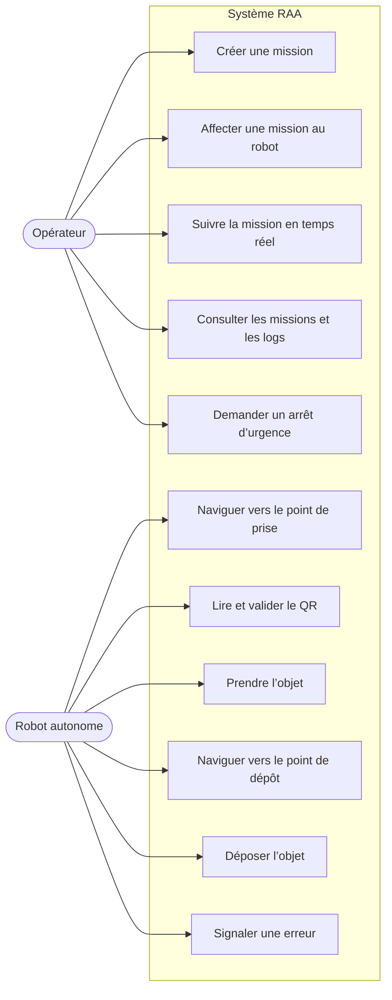
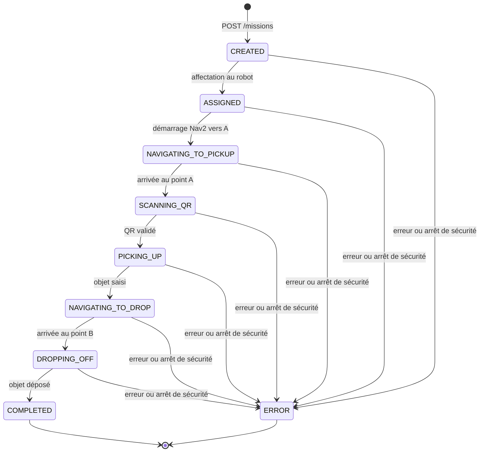
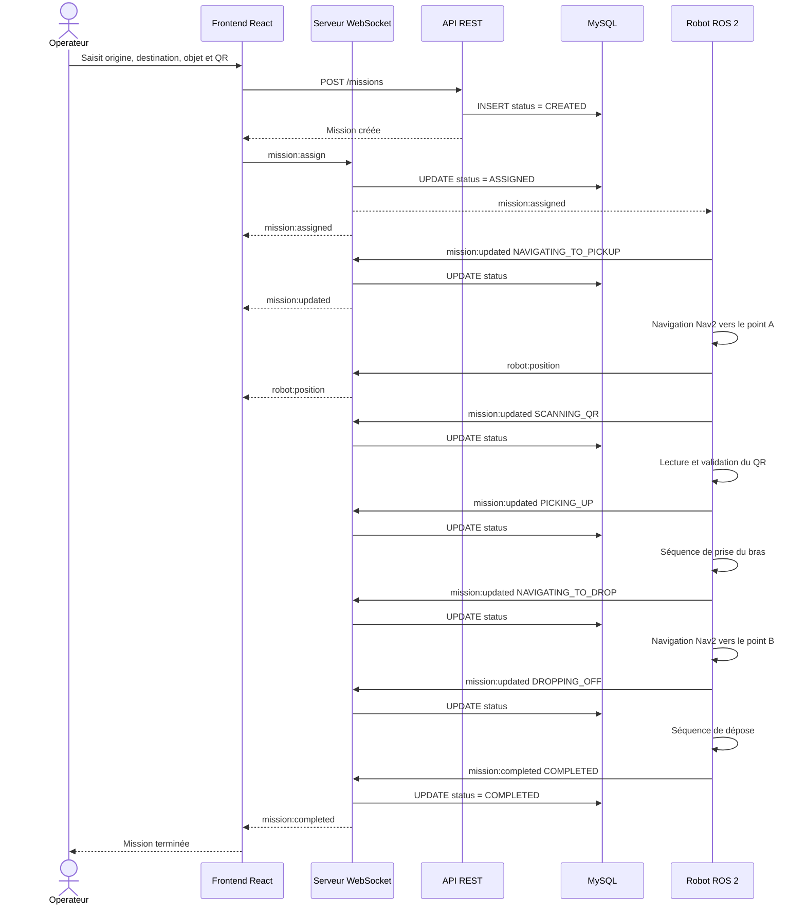
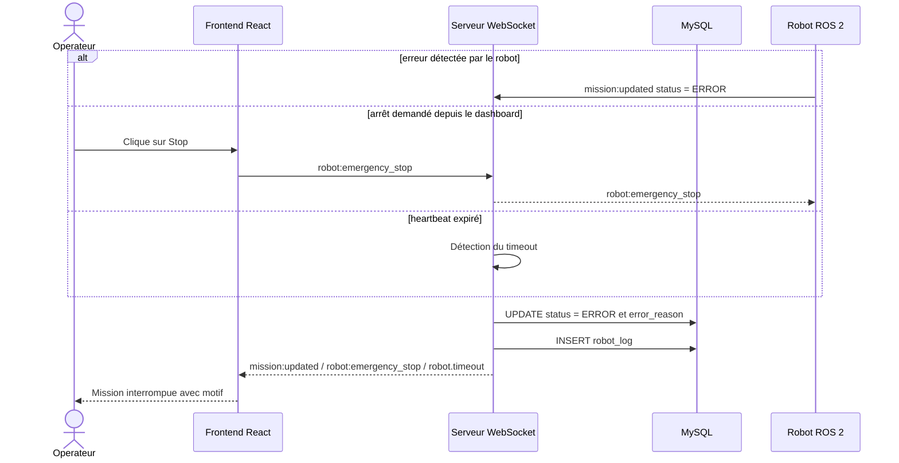

# Diagrammes UML — RAA

## Diagramme de cas d’utilisation

L’arrêt d’urgence est un événement de sécurité. Il place la mission dans l’état persistant `ERROR` et ne crée pas de statut terminal supplémentaire.

## Diagramme d’états — Mission

## Diagramme de séquence — Mission complète

## Diagramme de séquence — Erreur ou arrêt de sécurité

